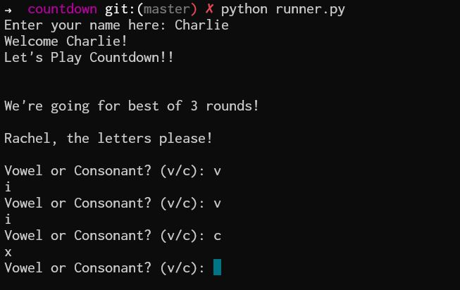
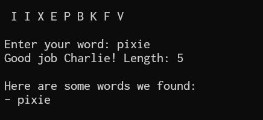

# Countdown
A countdown-style anagram game written in Python.  

Command to run the program: `python3 runner.py`   

**How to play:** 
* Enter your name
* Choose your vowels and consonants   
* Enter the largest anagram you could find within the 9 letters displayed   
* After 3 rounds, you'll see if you ranked top 5 on the leaderboards. 
* Enter Y or N if you want to play again   

Enjoy!!!